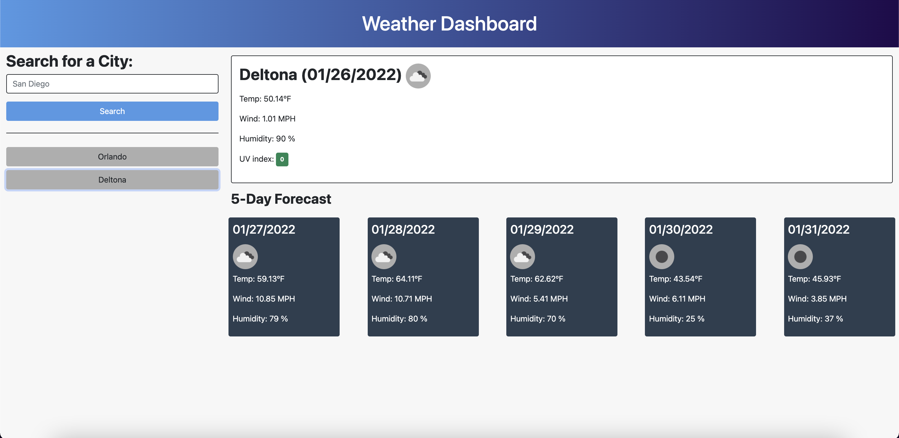
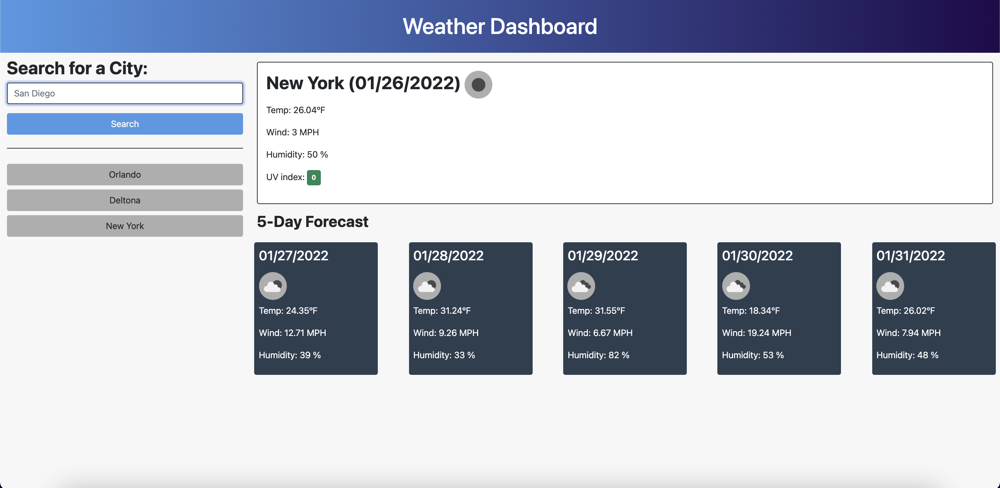

# My Weather Dashboard

## Description

This is a weather dashboard app that displays the current weather and the forecast for the next 5 days.
When searching for a city, the app will display and save the city in local storage and add the city button to the history section. 

## Weather API

The weather data is fetched from the [OpenWeatherMap API](https://openweathermap.org/api).

## Mockup

## Screenshots

## Development

Deployed application: [Live URL](https://jimenezraul.github.io/my-weather-dashboard/)